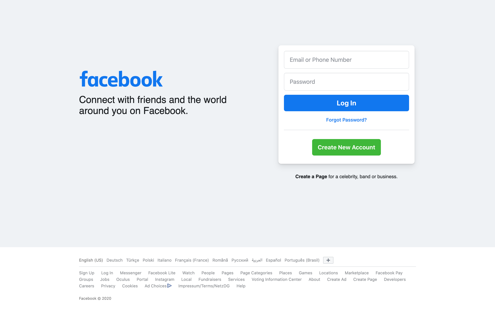
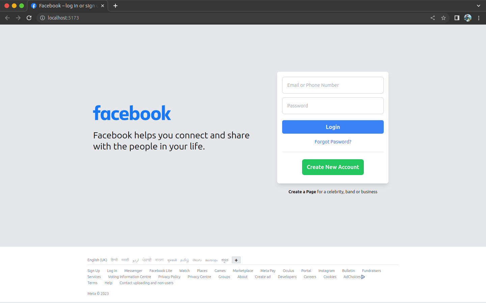

# Facebook Clone Page

This project is a clone of the Facebook homepage using HTML, CSS, Tailwind CSS, and Favicon for icons. It aims to replicate the look and feel of the Facebook homepage, showcasing its various sections and features.

## Table of Contents

- [Introduction](#introduction)
- [Technologies Used](#technologies-used)
- [Installation](#installation)
- [Usage](#usage)
- [Screenshots](#screenshots)

## Screenshots

Here are screenshots comparing the real Facebook homepage and the cloned page:


*Screenshot of the real Facebook homepage*


*Screenshot of the Facebook Clone Page*


## Introduction

The Facebook Clone Page project is a responsive website that closely resembles the design of the Facebook homepage. It utilizes HTML for structure, CSS for styling, Tailwind CSS for responsive layouts and utility classes, and Favicon for icons. The clone showcases the main sections and features present on the original Facebook homepage.

## Technologies Used

The website is built using the following technologies:

- HTML
- CSS
- Tailwind CSS
- Favicon

## Installation

To run this website locally, follow these steps:

1. Clone the repository:

```shell
git clone https://github.com/AnuragDutt36/facebook-login-page.git
```

2. Navigate to the project directory:

```shell
cd facebook-login-page
```

3. Install the required dependencies:

```shell
npm install
```

## Usage

To start the website locally, run the following command:

```shell
npm start
```

The website will be served at `http://localhost:3000` in your web browser.

## Contributing

Contributions to this project are welcome! If you find any issues or have suggestions for improvements, please open an issue or submit a pull request.
